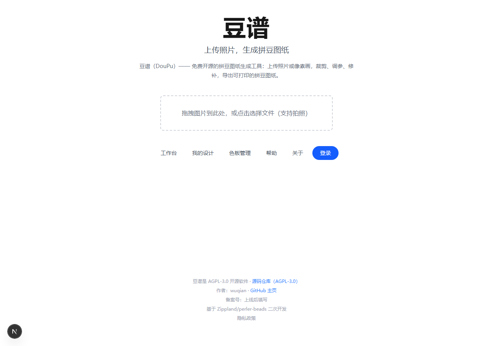
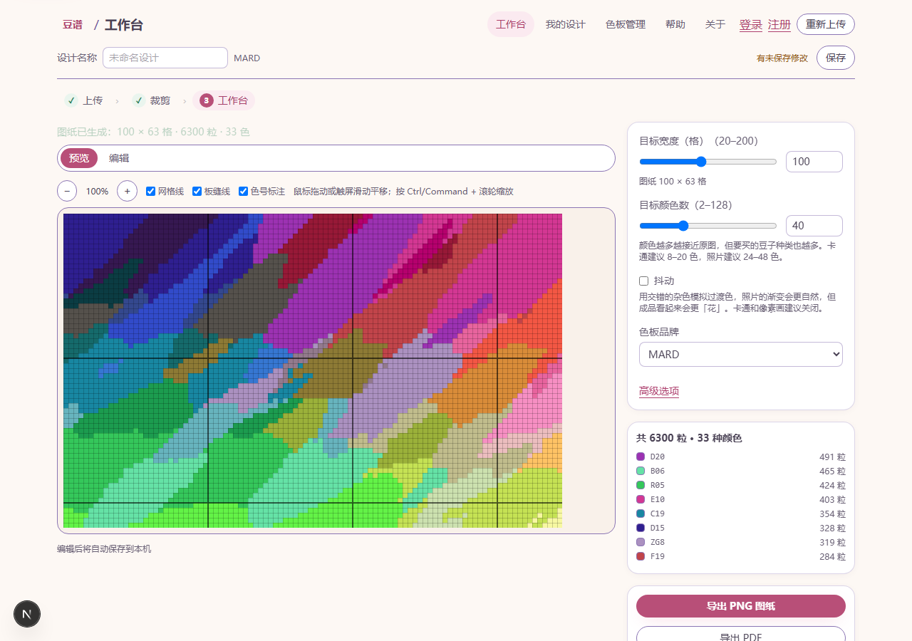

# 豆谱（DouPu）

[](https://github.com/527520/doupu/actions)
[](LICENSE)
[](https://github.com/527520/doupu)

上传照片，生成拼豆图纸 —— 免费、开源、无广告、无 AI 的拼豆图纸生成工具。

把照片或像素画变成可打印的拼豆图纸：裁剪 → 调整参数（尺寸/颜色数/抖动）→ 生成 → 像素级修补 → 导出 PNG 图纸、打印版 PDF（含图例与色号用量清单）或项目文件。支持账号体系与设计云端同步、自定义色板。

- 仓库：[github.com/527520/doupu](https://github.com/527520/doupu)
- 内置 5 套国产拼豆色板：漫德 MARD / COCO / 漫漫 / 盼盼 / 咪小窝（各 291 色）
- 仅 5mm 融合豆，图纸按 29×29 拼豆板绘制板缝线
- 原图永不上传服务器；云端仅同步图纸数据
- 许可证：AGPL-3.0（基于 [Zippland/perler-beads](https://github.com/Zippland/perler-beads) 二次开发，致谢见 [NOTICE.md](NOTICE.md)）

## 界面预览

| 首页 | 工作台（生成图纸后） |
|---|---|
|  |  |

截图由 `node docs/screenshots/capture.mjs` 生成（需本地 dev 服务器运行中）。

## 快速开始（开发）

要求：Node.js ≥ 20、npm。

```bash
npm ci
npm run dev        # http://localhost:3000
```

开发说明：未配置 SMTP 时验证/重置邮件不真实发送，链接会直接显示在注册/找回密码页面上（同时打印在服务器日志）；开发数据持久化在 `.pglite-dev/`（重启不丢失，删除该目录即重置）。

常用脚本：

| 命令 | 说明 |
|---|---|
| `npm run dev` | 开发服务器 |
| `npm run lint` | ESLint |
| `npm run typecheck` | TypeScript 检查 |
| `npm run test` | Vitest 单元/组件/API 测试（含 PGlite 进程内数据库） |
| `npm run test:e2e` | Playwright 三浏览器端到端测试（先 `npx playwright install`） |
| `npm run build` | 生产构建（standalone 输出） |
| `npx drizzle-kit generate` | 生成数据库迁移 |

数据库：测试使用 [PGlite](https://github.com/electric-sql/pglite)（进程内 Postgres，免 Docker）；
本地开发需要真实库时 `docker compose -f docker-compose.dev.yml up -d`（`DATABASE_URL` 见 `.env.example`）。

## 部署

国内单机方案（腾讯云轻量 + Docker + Caddy + 每日 COS 备份）：

1. 按 [deploy/CHECKLIST.md](deploy/CHECKLIST.md) 完成购机、域名、个人 ICP 备案、SES、COS（仅本人可操作）。
2. 服务器上克隆本仓库 → `cp .env.example .env` 并填写 → `bash deploy/scripts/deploy.sh`。
3. 恢复演练见 [deploy/restore.md](deploy/restore.md)。

镜像也可由 tag 触发的 CI 构建到 GitHub Container Registry（`ghcr.io/527520/doupu`）。

## 项目结构

```
src/lib/      纯逻辑（引擎/色板/图像/编辑器/导出/同步/认证，全部有单测）
src/components/  UI 组件（上传/裁剪/参数/预览/编辑器/导出/设计列表/色板）
src/app/       Next.js 页面与 /api 路由（账号、设计、色板）
db/            Drizzle schema、迁移、生产/测试客户端
tests/         测试 fixture 与全局设置；tests/e2e 为 Playwright 用例
deploy/        部署脚本、备份与备案检查单
docs/adr/      架构决策记录
```

## 测试

全量测试 460+ 例：纯算法（含属性测试与性能预算）、React 组件（jsdom）、
API 路由（PGlite 真实数据库语义）、E2E 主旅程（Chromium/Firefox/WebKit，含真实拖拽裁剪回归）。
边界情况矩阵见 `.scratch/photo-to-pattern/spec.md` §6（输入/参数/编辑/导出/账号/同步各类）。

## 作者与反馈

- 作者：wuqian（[github.com/527520](https://github.com/527520)）· 邮箱：wqa527520@qq.com
- 问题与建议：欢迎到 [GitHub Issues](https://github.com/527520/doupu/issues) 反馈

## 许可证

[AGPL-3.0](LICENSE)。上游致谢与第三方依赖许可见 [NOTICE.md](NOTICE.md)；
PDF 中文字体为 Noto Sans CJK SC（OFL-1.1）。
